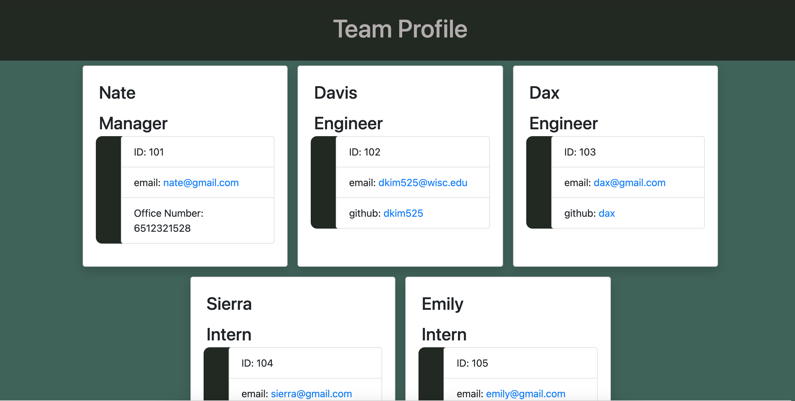

# Team Profile Generator
This is a team profile generator that creates a directory of employees with command line inputs

Video Demo: https://drive.google.com/file/d/15F7Kg0XDMs99exrQg9S_frqoWG-Ww27t/view?usp=sharing

---

## **Table of Contents**

1. [Links](#Links)
2. [Installation](#Installation)
3. [Technologies Used](#Technologies-Used)

---

## **Installation**
You can start this this application by first:

``npm i``

Then using:

``node index.js``

Run tests:

``npm run test``

## **Links**

[GitHub repository](https://github.com/dkim525/Team-Profile)

---
## **Technologies Used**
* HTML
* CSS
* Node.js
* Jest